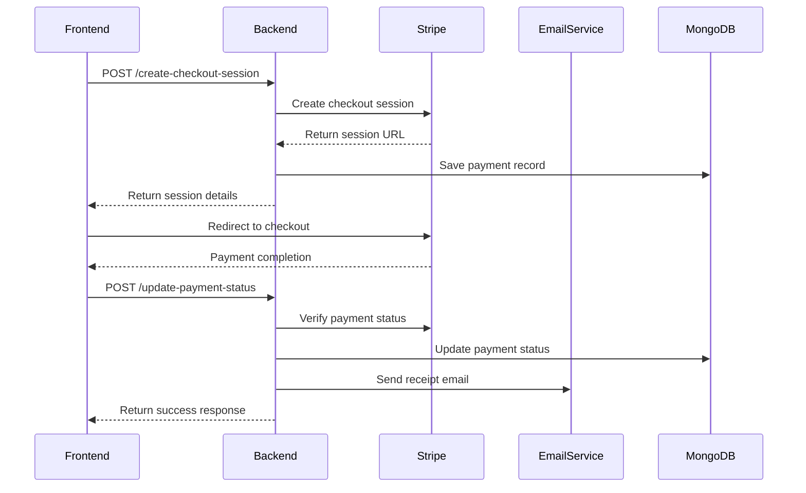
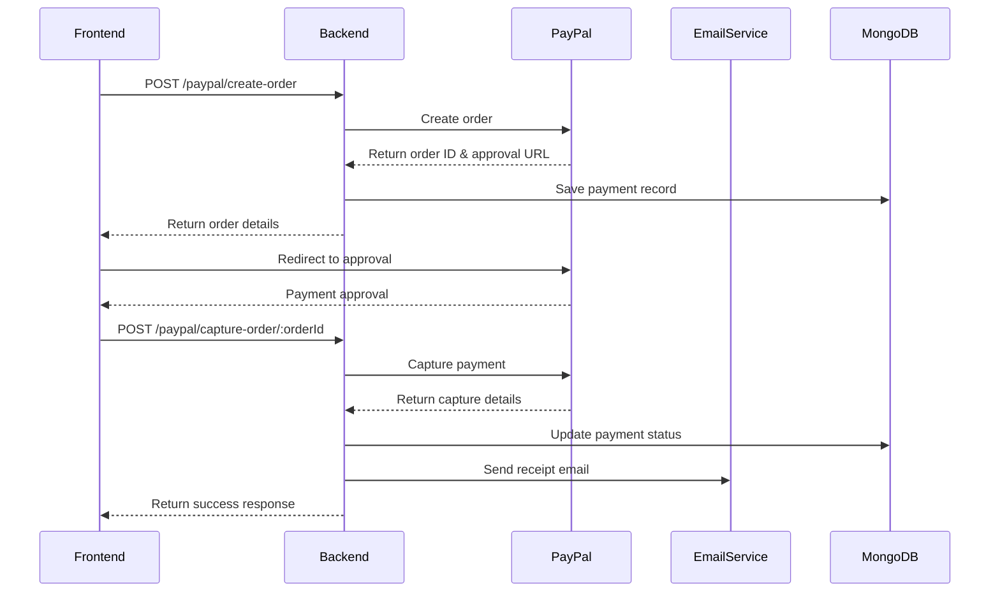

# UKTBC Email Service

A comprehensive email service for the UK Telugu Brahmin Community (UKTBC) donation system, featuring OAuth2 authentication with Microsoft Office 365 and automated PDF receipt generation.

## 🚀 Features

- **Dual Payment Integration** - Stripe & PayPal support
- **OAuth2 Authentication** with Microsoft Office 365
- **Automated PDF Receipt Generation** for donations
- **Gift Aid Processing** with proper documentation
- **HMRC Reporting** - Excel export for tax purposes
- **Event Management** - Create and manage community events
- **Project Management** - Track community projects and initiatives
- **Purohit Directory** - Religious service provider directory
- **Madi Vantalu Directory** - Catering service provider directory
- **Resource Management** - Community resources and documents
- **Frontend Integration** - Complete React frontend support
- **Professional Email Templates** with UKTBC branding
- **Real-time Payment Status Updates**
- **Webhook Support** for payment confirmations
- **File Upload & Management** with base64 conversion
- **Dashboard Analytics** - Community insights and statistics
- **Error Handling & Fallback Systems**
- **TypeScript Support** with full type safety

## 📋 Prerequisites

- Node.js (v22 or higher)
- TypeScript
- Microsoft Office 365 account
- Azure App Registration
- MongoDB (for payment data)
- **Stripe Account** (for card payments)
- **PayPal Developer Account** (for PayPal payments)

## 🛠️ Installation

1. **Clone the repository**
   ```bash
   git clone <repository-url>
   cd UKTBC_React_Backend
   ```

2. **Install dependencies**
   ```bash
   npm install
   ```

3. **Set up environment variables**
   ```bash
   cp .env.example .env
   ```

4. **Configure your .env file**
   ```env
   # OAuth2 Configuration
   OAUTH_CLIENT_ID=your_azure_client_id
   OAUTH_CLIENT_SECRET=your_azure_client_secret
   OAUTH_TENANT_ID=your_azure_tenant_id
   SMTP_FROM_EMAIL=donate@uktbc.org

   # Database Configuration
   MONGODB_URI=your_mongodb_connection_string

   # Stripe Configuration
   STRIPE_SECRET_KEY=sk_test_your_stripe_secret_key
   STRIPE_PUBLISHABLE_KEY=pk_test_your_stripe_publishable_key

   # PayPal Configuration
   PAYPAL_CLIENT_ID=your_paypal_client_id
   PAYPAL_CLIENT_SECRET=your_paypal_client_secret
   PAYPAL_ENV=sandbox  # or 'live' for production

   # Server Configuration
   PORT=3000
   FRONT_END_URL=http://localhost:5173
   ```

## 🔧 Azure App Registration Setup

### Step 1: Create Azure App Registration

1. Go to [Azure Portal](https://portal.azure.com)
2. Navigate to **Azure Active Directory** > **App registrations**
3. Click **New registration**
4. Fill in the details:
   - **Name**: UKTBC Email Service
   - **Supported account types**: Accounts in this organizational directory only
   - **Redirect URI**: `http://localhost:3003/smtpweb`

### Step 2: Configure API Permissions

1. Go to **API permissions**
2. Click **Add a permission**
3. Select **Microsoft Graph**
4. Choose **Application permissions**
5. Add these permissions:
   - `Mail.Send` - Send mail as any user
   - `User.Read.All` - Read all users' full profiles
6. Click **Grant admin consent**

### Step 3: Create Client Secret

1. Go to **Certificates & secrets**
2. Click **New client secret**
3. Add description: "UKTBC Email Service Secret"
4. Copy the secret value (you won't see it again!)

### Step 4: Get Tenant ID

1. Go to **Overview**
2. Copy the **Tenant ID** (Directory ID)

## 💳 Stripe Payment Integration Setup

### Step 1: Create Stripe Account

1. Go to [Stripe Dashboard](https://dashboard.stripe.com)
2. Create a new account or sign in
3. Complete account verification

### Step 2: Get API Keys

1. Go to **Developers** > **API Keys**
2. Copy your **Publishable Key** (starts with `pk_test_`)
3. Copy your **Secret Key** (starts with `sk_test_`)
4. Add them to your `.env` file

### Step 3: Configure Webhooks (Optional)

1. Go to **Developers** > **Webhooks**
2. Add endpoint: `https://yourdomain.com/api/payments/stripe/webhook`
3. Select events: `payment_intent.succeeded`, `checkout.session.completed`
4. Copy webhook signing secret to `.env` as `STRIPE_WEBHOOK_SECRET`

## 🏦 PayPal Payment Integration Setup

### Step 1: Create PayPal Developer Account

1. Go to [PayPal Developer Portal](https://developer.paypal.com)
2. Sign in with your PayPal account
3. Create a new application

### Step 2: Get API Credentials

1. Go to **My Apps & Credentials**
2. Create a new app:
   - **App Name**: UKTBC Donation System
   - **Merchant**: Your business account
   - **Features**: Accept payments
3. Copy **Client ID** and **Client Secret**
4. Add them to your `.env` file

### Step 3: Configure Environment

- **Sandbox**: Use for testing (`PAYPAL_ENV=sandbox`)
- **Live**: Use for production (`PAYPAL_ENV=live`)

## 🔄 Payment Flow Overview

### Stripe Payment Flow



### PayPal Payment Flow



## 📧 Email Service Configuration

### OAuth2 Flow

The service uses the **authorization_code** flow with the following parameters:

```typescript
const requestData = new URLSearchParams({
  client_id: clientId,
  client_secret: clientSecret,
  scope: "https://outlook.office365.com/.default",
  grant_type: "authorization_code",
  redirect_uri: 'http://localhost:3003/smtpweb',
  code: 'your_authorization_code'
});
```

### SMTP Configuration

```typescript
const transporter = nodemailer.createTransporter({
  host: "smtp.office365.com",
  port: 587,
  secure: false,
  auth: {
    type: "OAuth2",
    user: "website@UKTBC.org",
    accessToken: accessToken,
    clientId: config.OAUTH_CLIENT_ID,
    clientSecret: config.OAUTH_CLIENT_SECRET,
  },
  tls: {
    ciphers: "SSLv3",
    rejectUnauthorized: false,
  },
});
```

## 🏗️ Project Structure

```
src/
├── services/
│   └── emailService.ts          # Main email service
├── models/
│   ├── payments.ts              # Payment data model
│   ├── events.ts                # Event management model
│   ├── projects.ts              # Project management model
│   ├── purohit.ts               # Purohit directory model
│   ├── madiVantalu.ts           # Madi Vantalu directory model
│   ├── resources.ts             # Resource management model
│   ├── vipravani.ts             # Vipravani model
│   └── admin.ts                 # Admin user model
├── middleware/
│   ├── authmiddleware.ts        # Authentication middleware
│   ├── filetobase64converter.ts # File conversion utilities
│   ├── pdfUpload.ts            # PDF upload handling
│   └── upload.ts               # File upload middleware
├── routes/
│   ├── paymentRoutes.ts        # Payment API routes
│   ├── eventRoutes.ts          # Event management routes
│   ├── projectRoutes.ts        # Project management routes
│   ├── purohitRoutes.ts        # Purohit directory routes
│   ├── madivantaluRoutes.ts    # Madi Vantalu directory routes
│   ├── resourceRoutes.ts       # Resource management routes
│   ├── vipravaniRoutes.ts      # Vipravani routes
│   ├── adminRoutes.ts          # Admin management routes
│   ├── downloadHMRCRoutes.ts   # HMRC reporting routes
│   ├── getDashboardData.ts     # Dashboard analytics routes
│   ├── getServices.ts          # Service directory routes
│   ├── getResources.ts         # Resource listing routes
│   ├── footerCounter.ts        # Footer statistics routes
│   └── smtpweb.ts              # SMTP web interface
├── repos/
│   ├── paymentRepo.ts          # Payment data repository
│   ├── eventRepo.ts            # Event data repository
│   ├── projectRepo.ts          # Project data repository
│   ├── purohitRepo.ts          # Purohit data repository
│   ├── madiVantaluRepo.ts      # Madi Vantalu data repository
│   ├── resourceRepo.ts         # Resource data repository
│   ├── vipravaniRepo.ts        # Vipravani data repository
│   └── adminRepo.ts            # Admin data repository
├── config.ts                   # Configuration management
└── server.ts                   # Express server setup
```

## 🚀 Usage

### Stripe Payment Integration

#### Frontend Integration (React/JavaScript)

```javascript
// 1. Create checkout session
const createCheckoutSession = async (donationData) => {
  const response = await fetch('/api/payments/stripe/create-checkout-session', {
    method: 'POST',
    headers: { 'Content-Type': 'application/json' },
    body: JSON.stringify({
      amount: donationData.amount * 100, // Convert to pence
      email: donationData.email,
      firstName: donationData.firstName,
      lastName: donationData.lastName,
      giftAid: donationData.giftAid,
      paymentReference: donationData.paymentReference
    })
  });
  
  const { sessionId, url } = await response.json();
  
  // Redirect to Stripe Checkout
  window.location.href = url;
};

// 2. Handle payment completion
const handlePaymentSuccess = async (sessionId) => {
  const response = await fetch(`/api/payments/stripe/payment-status/${sessionId}`);
  const { status } = await response.json();
  
  if (status === 'paid') {
    console.log('Payment successful! Receipt email sent.');
  }
};
```

#### Backend Integration

```typescript
import { emailService } from './src/services/emailService';

// In your payment route handler
router.post('/stripe/update-payment-status', async (req, res) => {
  const { sessionId, status, paymentId } = req.body;
  
  // Update payment in database
  const updatedPayment = await Payment.findByIdAndUpdate(
    paymentId,
    { status },
    { new: true }
  );
  
  // Send receipt email if payment successful
  if (status === 'paid' && updatedPayment) {
    try {
      await emailService.initializeCredentials(sessionId, paymentId);
      await emailService.sendDonationReceipt(updatedPayment);
      console.log('Receipt email sent successfully!');
    } catch (error) {
      console.error('Email sending failed:', error);
    }
  }
  
  res.json({ success: true, payment: updatedPayment });
});
```

### PayPal Payment Integration

#### Frontend Integration

```javascript
// 1. Create PayPal order
const createPayPalOrder = async (donationData) => {
  const response = await fetch('/api/payments/paypal/create-order', {
    method: 'POST',
    headers: { 'Content-Type': 'application/json' },
    body: JSON.stringify({
      amount: donationData.amount.toString(),
      donor: {
        firstName: donationData.firstName,
        lastName: donationData.lastName,
        email: donationData.email,
        giftAid: donationData.giftAid,
        paymentReference: donationData.paymentReference
      }
    })
  });
  
  const { id, approvalUrl } = await response.json();
  
  // Redirect to PayPal approval
  window.location.href = approvalUrl;
};

// 2. Capture payment after approval
const capturePayPalPayment = async (orderId) => {
  const response = await fetch(`/api/payments/paypal/capture-order/${orderId}`, {
    method: 'POST'
  });
  
  const result = await response.json();
  console.log('Payment captured:', result);
};
```

### Email Service Usage

```typescript
import { emailService } from './src/services/emailService';

// Initialize with payment data
await emailService.initializeCredentials(sessionId, paymentId);

// Send donation receipt
await emailService.sendDonationReceipt(payment, recipientEmail);

// Send custom email
await emailService.sendCustomEmail({
  to: 'donor@example.com',
  subject: 'Thank you for your donation',
  html: '<h1>Thank you!</h1><p>Your donation has been received.</p>'
});
```

### Payment Data Structure

```typescript
interface Payment {
  _id: string;
  email: string;
  firstName: string;
  lastName: string;
  amount: number;
  giftAid: 'yes' | 'no';
  corpDonation: 'yes' | 'no';
  paymentReference: string;
  paymentType: string;
  stripeSessionId: string;
}
```

## 📄 PDF Receipt Generation

The service automatically generates professional PDF receipts with:

- **UKTBC Logo** and branding
- **Donation Details** (amount, date, reference)
- **Gift Aid Information** (if applicable)
- **Charity Registration** details
- **Professional Layout** with proper formatting

### PDF Features

- **Dynamic Content** based on payment data
- **Gift Aid Calculations** (25% of donation amount)
- **Professional Styling** with UKTBC colors
- **Base64 Encoding** for email attachment
- **Error Handling** for missing data

## 🔍 Testing

### Test Payment Integrations

#### Test Stripe Integration

```bash
# Test Stripe payment creation
curl -X POST http://localhost:3000/api/payments/stripe/create-checkout-session \
  -H "Content-Type: application/json" \
  -d '{
    "amount": 10000,
    "email": "test@example.com",
    "firstName": "Test",
    "lastName": "User",
    "giftAid": "yes",
    "paymentReference": "TEST-001"
  }'
```

#### Test PayPal Integration

```bash
# Test PayPal order creation
curl -X POST http://localhost:3000/api/payments/paypal/create-order \
  -H "Content-Type: application/json" \
  -d '{
    "amount": "100.00",
    "donor": {
      "firstName": "Test",
      "lastName": "User",
      "email": "test@example.com",
      "giftAid": "yes",
      "paymentReference": "TEST-001"
    }
  }'
```

### Test Email Service

```bash
# Build the project
npm run build

# Test email functionality
node test-email-service.js
```

### Test OAuth2 Flow

```bash
# Test OAuth2 token acquisition
node test-oauth-working.js
```

### Test Complete Payment Flow

```bash
# Test end-to-end payment with email
npm run test:payments
```

### Test HMRC Reporting

```bash
# Test HMRC Excel generation
curl -X GET http://localhost:3000/api/hmrc/generate-donations-excel
```

### Test Event Management

```bash
# Test event creation
curl -X POST http://localhost:3000/api/events/add \
  -F "eventName=Test Event" \
  -F "startDate=2024-12-25" \
  -F "startTime=10:00" \
  -F "description=Test event description" \
  -F "ticketPrice=25.00" \
  -F "availableTickets=100" \
  -F "preRequisites=Valid ID" \
  -F "registrationDetails=Register online" \
  -F "status=1"

# Test get events
curl -X GET http://localhost:3000/api/events/get
```

### Test Project Management

```bash
# Test project creation
curl -X POST http://localhost:3000/api/projects/add \
  -F "projectTitle=Test Project" \
  -F "tagline=Test tagline" \
  -F "description=Test description" \
  -F "vision=Test vision" \
  -F "projectType=Education" \
  -F "status=active"

# Test get projects
curl -X GET http://localhost:3000/api/projects/get
```

### Test Service Directories

```bash
# Test purohit creation
curl -X POST http://localhost:3000/api/purohit/add \
  -F "fullName=Test Purohit" \
  -F "serviceLocations=London" \
  -F "mobile=01234567890" \
  -F "email=test@example.com" \
  -F "familyName=Test Family" \
  -F "status=1"

# Test madi vantalu creation
curl -X POST http://localhost:3000/api/madivantalu/add \
  -F "catererName=Test Caterer" \
  -F "serviceLocations=London" \
  -F "mobile=01234567890" \
  -F "status=1"

# Test get services
curl -X GET http://localhost:3000/api/services/latest
```

### Test Dashboard Analytics

```bash
# Test dashboard data
curl -X GET http://localhost:3000/api/dashboard/data

# Test footer counter
curl -X GET http://localhost:3000/api/footer/counter
```

## 🧪 Test Data

### Stripe Test Cards

- **Success**: `4242424242424242`
- **Declined**: `4000000000000002`
- **3D Secure**: `4000002500003155`

### PayPal Test Accounts

- **Buyer Email**: `sb-buyer@personal.example.com`
- **Password**: Use PayPal sandbox test accounts

## 📊 Monitoring & Logging

### Payment Monitoring

The system logs all payment activities:

```typescript
// Payment creation
console.log('Payment created:', paymentId);

// Payment status updates
console.log('Payment status updated:', status);

// Email sending
console.log('Receipt email sent to:', email);
```

### Error Tracking

```typescript
// Payment failures
console.error('Payment failed:', error);

// Email failures
console.error('Email sending failed:', error);

// OAuth2 failures
console.error('OAuth2 authentication failed:', error);
```

## 🐛 Troubleshooting

### Common Issues

1. **OAuth2 Authentication Failed**
   - Check Azure App Registration permissions
   - Verify client secret is correct
   - Ensure admin consent is granted

2. **SMTP Connection Issues**
   - Verify Office 365 account permissions
   - Check firewall settings
   - Ensure TLS/SSL configuration

3. **PDF Generation Errors**
   - Check file paths for logo image
   - Verify payment data structure
   - Ensure proper error handling

### Debug Mode

Enable debug logging by setting:

```env
DEBUG=email-service:*
```

## 📊 HMRC Reporting System

### Generate Donations Excel Report

The system includes comprehensive HMRC reporting functionality for Gift Aid donations:

#### Features
- **Excel Export** - Generates R68GAD format Excel files
- **Gift Aid Calculations** - Automatic calculation of eligible donations
- **Donor Information** - Complete donor details for HMRC submission
- **Date Formatting** - Proper UK date format (DD/MM/YY)
- **Professional Layout** - HMRC-compliant formatting

#### API Endpoint
```http
GET /api/hmrc/generate-donations-excel
```

#### Response
```json
{
  "message": "Excel file generated successfully",
  "path": "/path/to/donations.xlsx"
}
```

#### Excel File Structure
- **Header Section** - Total donations calculation
- **Donations Schedule** - Detailed donor information
- **Columns**: Item, Title, First Name, Last Name, House/Number, Postcode, Aggregated Donations, Sponsored Event, Donation Date, Amount

## 🎉 Event Management System

### Event Model
```typescript
interface Event {
  eventName: string;
  startDate: string;
  startTime: string;
  description: string;
  ticketPrice: string;
  availableTickets: string;
  preRequisites: string[];
  registrationDetails: string;
  filePath: string;
  status: string;
}
```

### Event API Endpoints

#### Create Event
```http
POST /api/events/add
Content-Type: multipart/form-data

{
  "eventName": "Community Festival 2024",
  "startDate": "2024-12-25",
  "startTime": "10:00",
  "description": "Annual community celebration",
  "ticketPrice": "25.00",
  "availableTickets": "100",
  "preRequisites": ["Valid ID", "Registration required"],
  "registrationDetails": "Register online or call 01234567890",
  "status": "1"
}
```

#### Get All Events
```http
GET /api/events/get
```

#### Update Event
```http
PUT /api/events/update/:id
Content-Type: multipart/form-data
```

#### Delete Event
```http
DELETE /api/events/delete/:id
```

## 🏗️ Project Management System

### Project Model
```typescript
interface Project {
  projectTitle: string;
  tagline: string;
  description: string;
  vision: string;
  impactPoints: string[];
  projectType: string;
  highlights: string[];
  events: Event[];
  filePath: string;
  status: "draft" | "active" | "completed";
}
```

### Project API Endpoints

#### Create Project
```http
POST /api/projects/add
Content-Type: multipart/form-data

{
  "projectTitle": "Community Education Initiative",
  "tagline": "Empowering through education",
  "description": "Educational programs for community members",
  "vision": "To provide quality education to all community members",
  "impactPoints": ["100+ students helped", "5 schools supported"],
  "projectType": "Education",
  "highlights": ["Scholarship program", "Tutoring services"],
  "events": [
    {
      "eventTitle": "Education Fair",
      "eventDescription": "Annual education fair",
      "eventDate": "2024-03-15",
      "eventTime": "10:00",
      "registrationLink": "https://example.com/register"
    }
  ],
  "status": "active"
}
```

#### Get All Projects
```http
GET /api/projects/get
```

#### Update Project
```http
PUT /api/projects/update/:id
Content-Type: multipart/form-data
```

## 🕉️ Purohit Directory System

### Purohit Model
```typescript
interface Purohit {
  fullName: string;
  serviceLocations: string[];
  mobile: string;
  email: string;
  familyName: string;
  filePath: string;
  status: string;
}
```

### Purohit API Endpoints

#### Add Purohit
```http
POST /api/purohit/add
Content-Type: multipart/form-data

{
  "fullName": "Sri Rama Krishna Sharma",
  "serviceLocations": ["London", "Birmingham", "Manchester"],
  "mobile": "01234567890",
  "email": "purohit@example.com",
  "familyName": "Sharma Family",
  "status": "1"
}
```

#### Get All Purohits
```http
GET /api/purohit/get
```

#### Get Latest Purohits
```http
GET /api/services/latest
```

## 🍽️ Madi Vantalu Directory System

### Madi Vantalu Model
```typescript
interface MadiVantalu {
  catererName: string;
  serviceLocations: string[];
  mobile: string;
  filePath: string;
  status: string;
}
```

### Madi Vantalu API Endpoints

#### Add Madi Vantalu
```http
POST /api/madivantalu/add
Content-Type: multipart/form-data

{
  "catererName": "Sai Catering Services",
  "serviceLocations": ["London", "Birmingham"],
  "mobile": "01234567890",
  "status": "1"
}
```

#### Get All Madi Vantalu
```http
GET /api/madivantalu/get
```

## 📚 Resource Management System

### Resource Model
```typescript
interface Resource {
  title: string;
  description: string;
  category: string;
  filePath: string;
  status: string;
}
```

### Resource API Endpoints

#### Add Resource
```http
POST /api/resources/add
Content-Type: multipart/form-data

{
  "title": "Community Guidelines",
  "description": "Guidelines for community members",
  "category": "Documents",
  "status": "1"
}
```

#### Get All Resources
```http
GET /api/resources/get
```

## 📊 Dashboard Analytics

### Dashboard API Endpoints

#### Get Dashboard Data
```http
GET /api/dashboard/data
```

#### Get Footer Counter
```http
GET /api/footer/counter
```

## 🌐 Frontend Integration

### React Frontend Setup

The backend is designed to work seamlessly with a React frontend:

#### Frontend Configuration
```javascript
// Frontend API configuration
const API_BASE_URL = process.env.REACT_APP_API_URL || 'http://localhost:3000';

// API service functions
export const apiService = {
  // Payment APIs
  createStripeSession: (data) => fetch(`${API_BASE_URL}/api/payments/stripe/create-checkout-session`, {
    method: 'POST',
    headers: { 'Content-Type': 'application/json' },
    body: JSON.stringify(data)
  }),
  
  // Event APIs
  getEvents: () => fetch(`${API_BASE_URL}/api/events/get`),
  createEvent: (formData) => fetch(`${API_BASE_URL}/api/events/add`, {
    method: 'POST',
    body: formData
  }),
  
  // Project APIs
  getProjects: () => fetch(`${API_BASE_URL}/api/projects/get`),
  createProject: (formData) => fetch(`${API_BASE_URL}/api/projects/add`, {
    method: 'POST',
    body: formData
  }),
  
  // Service Directory APIs
  getServices: () => fetch(`${API_BASE_URL}/api/services/latest`),
  
  // HMRC Reporting
  generateHMRCReport: () => fetch(`${API_BASE_URL}/api/hmrc/generate-donations-excel`)
};
```

#### Frontend Environment Variables
```env
REACT_APP_API_URL=http://localhost:3000
REACT_APP_STRIPE_PUBLISHABLE_KEY=pk_test_your_stripe_key
REACT_APP_PAYPAL_CLIENT_ID=your_paypal_client_id
```

## 📝 API Endpoints

### Stripe Payment Endpoints

#### Create Payment Intent
```http
POST /api/payments/stripe/create-stripe-payment-intent
Content-Type: application/json

{
  "amount": 10000,
  "currency": "GBP",
  "email": "donor@example.com",
  "firstName": "John",
  "lastName": "Doe",
  "giftAid": "yes",
  "paymentReference": "DON-2024-001"
}
```

#### Confirm Payment
```http
POST /api/payments/stripe/confirm-stripe-payment
Content-Type: application/json

{
  "paymentIntentId": "pi_1234567890"
}
```

#### Create Checkout Session
```http
POST /api/payments/stripe/create-checkout-session
Content-Type: application/json

{
  "amount": 10000,
  "email": "donor@example.com",
  "firstName": "John",
  "lastName": "Doe",
  "giftAid": "yes",
  "paymentReference": "DON-2024-001"
}
```

#### Check Payment Status
```http
GET /api/payments/stripe/payment-status/:sessionId
```

#### Update Payment Status
```http
POST /api/payments/stripe/update-payment-status
Content-Type: application/json

{
  "sessionId": "cs_1234567890",
  "status": "paid",
  "paymentId": "507f1f77bcf86cd799439011",
  "senderEmail": "donor@example.com"
}
```

### PayPal Payment Endpoints

#### Create PayPal Order
```http
POST /api/payments/paypal/create-order
Content-Type: application/json

{
  "amount": "100.00",
  "donor": {
    "firstName": "John",
    "lastName": "Doe",
    "email": "donor@example.com",
    "giftAid": "yes",
    "paymentReference": "DON-2024-001"
  }
}
```

#### Capture PayPal Order
```http
POST /api/payments/paypal/capture-order/:orderId
```

### Email Service Endpoints

#### Send Receipt Email
```http
POST /api/email/send-receipt
Content-Type: application/json

{
  "paymentId": "507f1f77bcf86cd799439011",
  "recipientEmail": "donor@example.com"
}
```

## 🔒 Security Features

- **OAuth2 Authentication** with Microsoft Office 365
- **Secure Token Storage** (no hardcoded credentials)
- **Input Validation** for all email data
- **Error Handling** without exposing sensitive information
- **Rate Limiting** for email sending

## 📊 Monitoring

The service includes comprehensive logging for:

- **OAuth2 Token Acquisition**
- **SMTP Connection Status**
- **Email Send Success/Failure**
- **PDF Generation Status**
- **Error Tracking**

## 🤝 Contributing

1. Fork the repository
2. Create a feature branch
3. Make your changes
4. Add tests if applicable
5. Submit a pull request

## 📄 License

This project is licensed under the MIT License - see the LICENSE file for details.

## 🆘 Support

For support and questions:

- **Email**: donate@uktbc.org
- **Documentation**: See inline code comments
- **Issues**: Create a GitHub issue

## 🏷️ Version History

- **v1.0.0** - Initial release with OAuth2 support
- **v1.1.0** - Added PDF receipt generation
- **v1.2.0** - Enhanced error handling and logging
- **v1.3.0** - Added fallback authentication methods
- **v2.0.0** - Added Stripe & PayPal payment integration
- **v2.1.0** - Added HMRC reporting system
- **v2.2.0** - Added event management system
- **v2.3.0** - Added project management system
- **v2.4.0** - Added service directories (Purohit & Madi Vantalu)
- **v2.5.0** - Added resource management system
- **v2.6.0** - Added dashboard analytics
- **v2.7.0** - Added frontend integration support
- **v3.0.0** - Complete community management platform

## 🎯 Complete Feature Summary

### 💰 Payment System
- **Stripe Integration** - Card payments with webhooks
- **PayPal Integration** - PayPal payments with order management
- **Gift Aid Processing** - Automatic Gift Aid calculations
- **PDF Receipts** - Professional donation receipts
- **Email Notifications** - Automated receipt emails

### 📊 Reporting & Analytics
- **HMRC Reporting** - Excel export for tax purposes
- **Dashboard Analytics** - Community insights and statistics
- **Footer Counters** - Real-time community metrics

### 🎉 Community Management
- **Event Management** - Create, manage, and track community events
- **Project Management** - Track community projects and initiatives
- **Service Directories** - Purohit and Madi Vantalu directories
- **Resource Management** - Community resources and documents

### 🔧 Technical Features
- **OAuth2 Authentication** - Microsoft Office 365 integration
- **File Upload System** - Image and document management
- **Base64 Conversion** - Frontend-friendly file handling
- **TypeScript Support** - Full type safety
- **Error Handling** - Comprehensive error management
- **API Documentation** - Complete API reference

### 🌐 Frontend Integration
- **React Support** - Complete React frontend integration
- **API Service Layer** - Ready-to-use API service functions
- **Environment Configuration** - Frontend environment setup
- **CORS Support** - Cross-origin request handling

---

**UK Telugu Brahmin Community**  
Charity registered in England & Wales No. 1205566  
Email: donate@uktbc.org